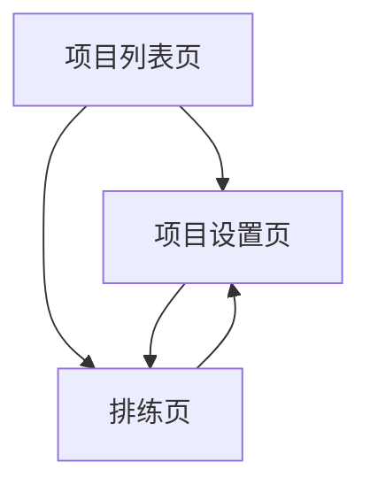

## 1. 产品概述

这是一个面向多人合唱、对唱、轮唱排练场景的网站，核心目标是清晰展示完整歌词，明确区分每个人唱哪一句/哪一段，提供可升Pitch（不变速）的音频播放，方便找到适合大家的调。

产品定位为：排练优先，其次才是编辑。主要解决纸质或群聊歌词分配混乱、升调伴奏获取麻烦、投屏/个人练习时歌词不够直观等问题。

## 2. 核心功能

### 2.1 用户角色

本产品在MVP阶段不区分用户权限，所有用户默认可查看和编辑项目内容。

### 2.2 功能模块

我们的歌曲排练与分词演唱网站包含以下主要页面：

1. **项目列表页**：显示所有项目，快速进入排练
2. **项目设置页**：音频上传、成员管理、歌词分配设置
3. **排练页**：核心使用页面，提供播放器控制和歌词展示

### 2.3 页面详情

| 页面名称  | 模块名称    | 功能描述                   |
| ----- | ------- | ---------------------- |
| 项目列表页 | 项目卡片列表  | 显示歌名、成员人数、音频时长、最近更新时间  |
| 项目列表页 | 新建项目按钮  | 创建新的排练项目               |
| 项目列表页 | 项目设置入口  | 点击设置按钮进入项目配置页面         |
| 项目设置页 | 音频设置    | 上传/替换音频文件，预览播放，显示音频时长  |
| 项目设置页 | 成员管理    | 添加成员，自动分配颜色标识          |
| 项目设置页 | 歌词编辑与分配 | 逐行编辑歌词，选择成员进行行级分配      |
| 排练页   | 播放控制区   | 播放/暂停、进度条、Pitch调节、循环控制 |
| 排练页   | 视图控制区   | 切换全部歌词/只看我视角，成员过滤      |
| 排练页   | 歌词列表区   | 显示分配成员、歌词文本、当前行高亮      |

## 3. 核心流程

### 首次创建项目流程

项目列表页 → 新建项目 → 项目设置页（音频→成员→歌词分配）→ 进入排练页

### 日常排练流程

项目列表页 → 选择项目 → 排练页 → 调整Pitch → 选择视角 → 点击歌词行练习

### 临时调整流程

排练页 → 设置按钮 → 项目设置页修改 → 返回排练页

## 4. 用户界面设计

### 4.1 设计风格

* **主色调**：深色系背景（#1a1a1a）配合亮色强调

* **辅助色**：成员分配使用鲜明区分颜色（红、蓝、绿、橙等）

* **按钮样式**：扁平化设计，圆角矩形

* **字体**：系统默认无衬线字体，歌词大字号显示

* **布局风格**：上下分区布局，顶部固定控制区

* **图标风格**：简洁线性图标，强调功能性

### 4.2 页面设计概述

| 页面名称  | 模块名称  | UI元素                   |
| ----- | ----- | ---------------------- |
| 项目列表页 | 项目卡片  | 卡片式布局，白色背景，阴影效果，显示关键信息 |
| 项目设置页 | Tab导航 | 顶部Tab切换，清晰标注三个步骤       |
| 项目设置页 | 音频设置  | 大按钮上传，音频波形预览           |
| 项目设置页 | 成员管理  | 圆形头像+颜色标识，横向排列         |
| 项目设置页 | 歌词分配  | 左右分栏，左侧歌词列表，右侧分配工具     |
| 排练页   | 播放控制  | 大播放按钮居中，Pitch调节使用+/-按钮 |
| 排练页   | 歌词显示  | 大字号歌词，成员颜色条标识，当前行高亮    |

### 4.3 响应式设计

采用桌面优先设计，适配大屏幕排练场景。移动端保持核心功能可用，优化触摸操作。

### 4.4 交互设计原则

* 所有状态变化必须有明确视觉反馈

* 关键操作（播放、Pitch调节）需要即时响应

* 排练页状态保持，切换页面后保留Pitch值、视角等设置

