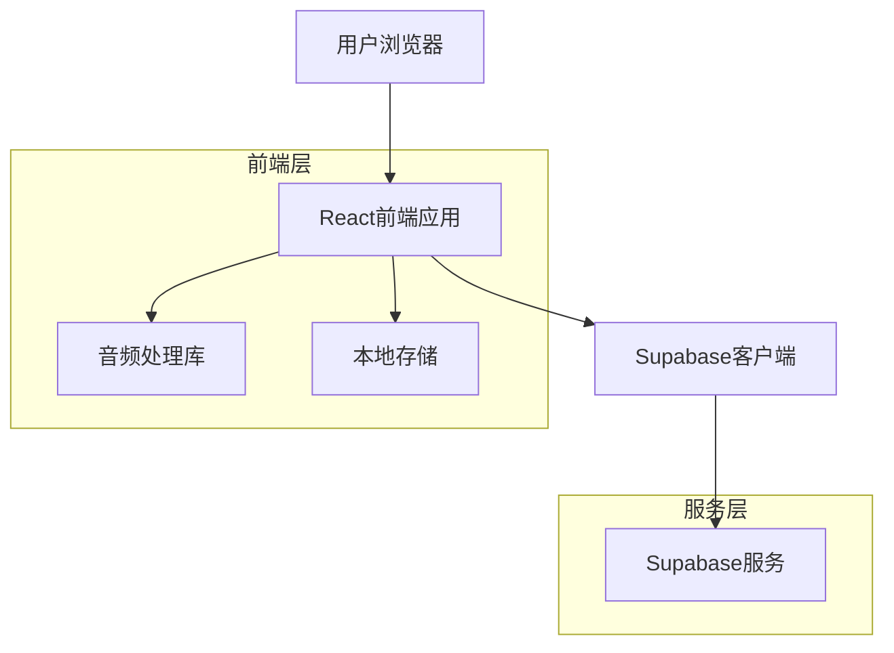
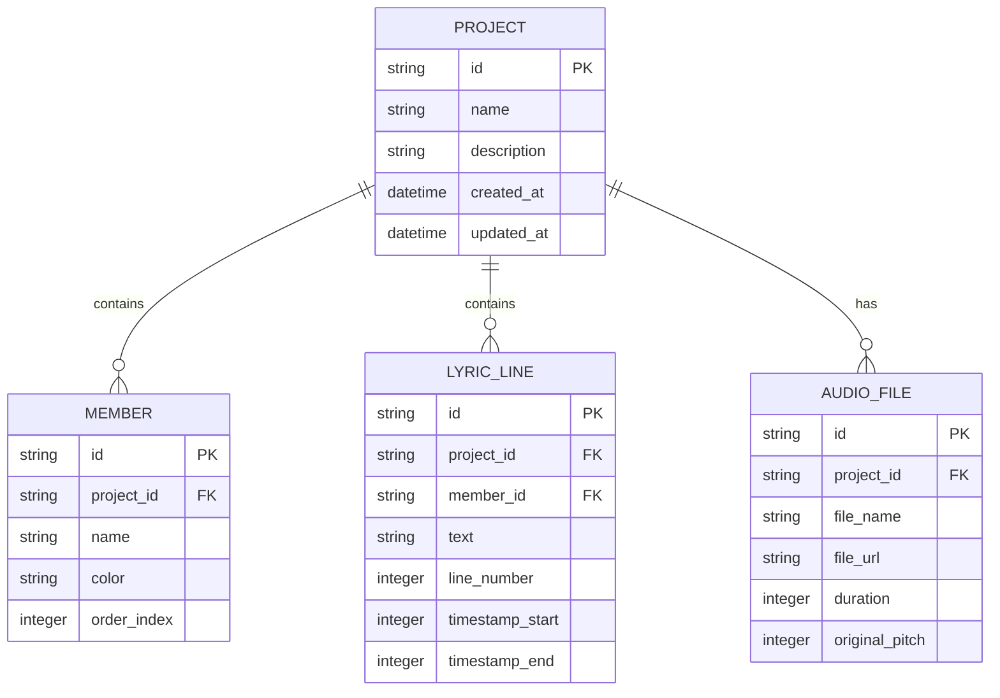
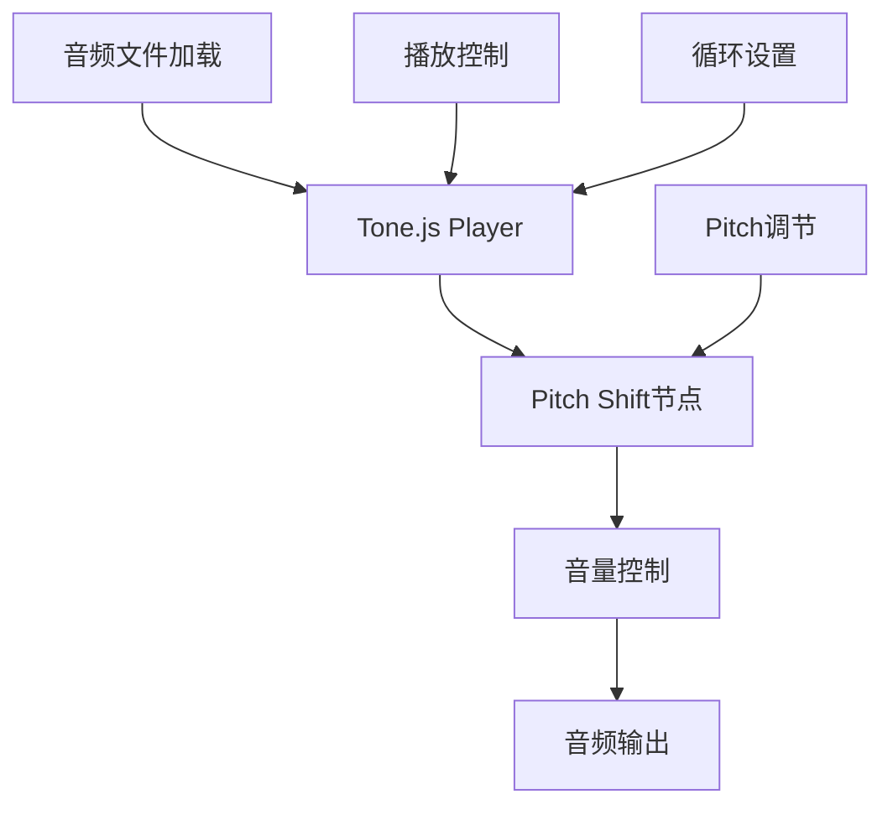

## 1. 架构设计



## 2. 技术描述

* **前端**: React\@18 + TailwindCSS\@3 + Vite

* **初始化工具**: vite-init

* **音频处理**: Tone.js（用于Pitch变换和播放控制）

* **数据存储**: Supabase（PostgreSQL）

* **状态管理**: React Context + Local Storage

## 3. 路由定义

| 路由                     | 用途               |
| ---------------------- | ---------------- |
| /                      | 项目列表页，显示所有排练项目   |
| /project/:id/setup     | 项目设置页，配置音频、成员、歌词 |
| /project/:id/rehearsal | 排练页，核心使用页面       |
| /project/new           | 新建项目页面           |

## 4. 核心数据模型

### 4.1 数据模型定义



### 4.2 数据定义语言

项目表 (projects)

```sql
CREATE TABLE projects (
    id UUID PRIMARY KEY DEFAULT gen_random_uuid(),
    name VARCHAR(255) NOT NULL,
    description TEXT,
    created_at TIMESTAMP WITH TIME ZONE DEFAULT NOW(),
    updated_at TIMESTAMP WITH TIME ZONE DEFAULT NOW()
);

-- 创建索引
CREATE INDEX idx_projects_created_at ON projects(created_at DESC);
```

成员表 (members)

```sql
CREATE TABLE members (
    id UUID PRIMARY KEY DEFAULT gen_random_uuid(),
    project_id UUID REFERENCES projects(id) ON DELETE CASCADE,
    name VARCHAR(100) NOT NULL,
    color VARCHAR(7) NOT NULL, -- 十六进制颜色值
    order_index INTEGER DEFAULT 0,
    created_at TIMESTAMP WITH TIME ZONE DEFAULT NOW()
);

-- 创建索引
CREATE INDEX idx_members_project_id ON members(project_id);
```

歌词行表 (lyric\_lines)

```sql
CREATE TABLE lyric_lines (
    id UUID PRIMARY KEY DEFAULT gen_random_uuid(),
    project_id UUID REFERENCES projects(id) ON DELETE CASCADE,
    member_id UUID REFERENCES members(id) ON DELETE SET NULL,
    text TEXT NOT NULL,
    line_number INTEGER NOT NULL,
    timestamp_start INTEGER DEFAULT 0, -- 毫秒
    timestamp_end INTEGER DEFAULT 0,   -- 毫秒
    created_at TIMESTAMP WITH TIME ZONE DEFAULT NOW()
);

-- 创建索引
CREATE INDEX idx_lyric_lines_project_id ON lyric_lines(project_id);
CREATE INDEX idx_lyric_lines_line_number ON lyric_lines(line_number);
```

音频文件表 (audio\_files)

```sql
CREATE TABLE audio_files (
    id UUID PRIMARY KEY DEFAULT gen_random_uuid(),
    project_id UUID REFERENCES projects(id) ON DELETE CASCADE,
    file_name VARCHAR(255) NOT NULL,
    file_url TEXT NOT NULL,
    duration INTEGER NOT NULL, -- 毫秒
    original_pitch INTEGER DEFAULT 0,
    uploaded_at TIMESTAMP WITH TIME ZONE DEFAULT NOW()
);

-- 创建索引
CREATE INDEX idx_audio_files_project_id ON audio_files(project_id);
```

## 5. 音频处理架构



## 6. 前端状态管理

### 6.1 全局状态（Context）

* 当前项目信息

* 播放状态（播放/暂停）

* 当前Pitch值

* 循环模式

* 当前选中歌词行

### 6.2 本地存储（LocalStorage）

* 最近使用的项目ID

* 用户偏好设置（视角模式、Pitch值）

* 离线缓存的项目数据

## 7. 权限设置

```sql
-- 匿名用户只读权限
GRANT SELECT ON projects TO anon;
GRANT SELECT ON members TO anon;
GRANT SELECT ON lyric_lines TO anon;
GRANT SELECT ON audio_files TO anon;

-- 认证用户完整权限
GRANT ALL PRIVILEGES ON projects TO authenticated;
GRANT ALL PRIVILEGES ON members TO authenticated;
GRANT ALL PRIVILEGES ON lyric_lines TO authenticated;
GRANT ALL PRIVILEGES ON audio_files TO authenticated;
```

## 8. 性能优化策略

* 使用React.memo优化组件重渲染

* Tone.js音频节点复用

